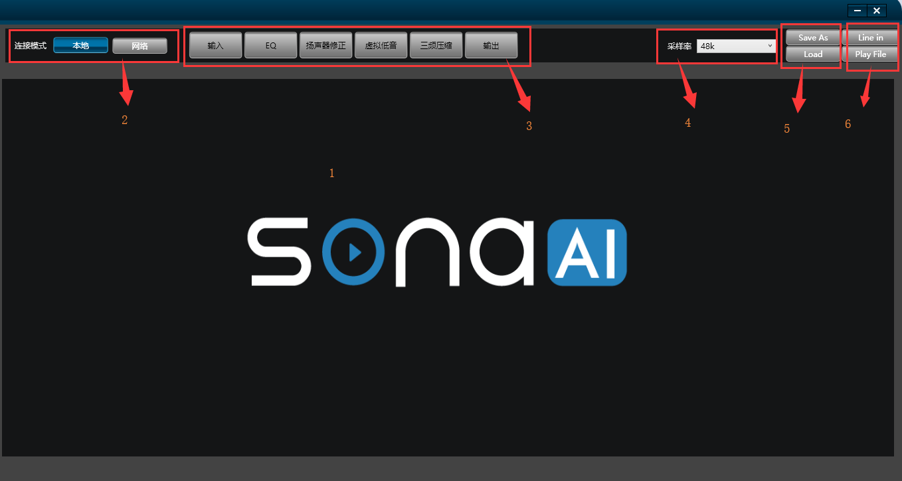
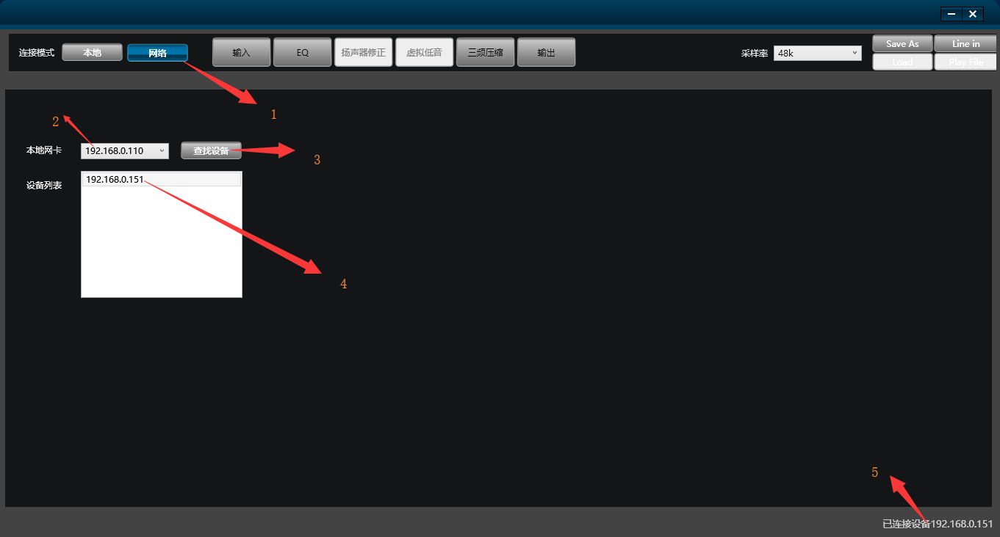
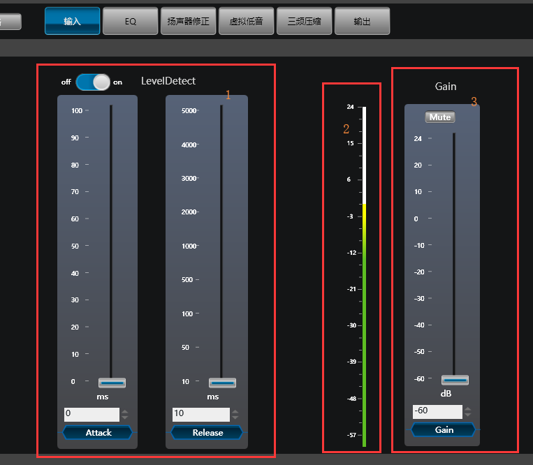
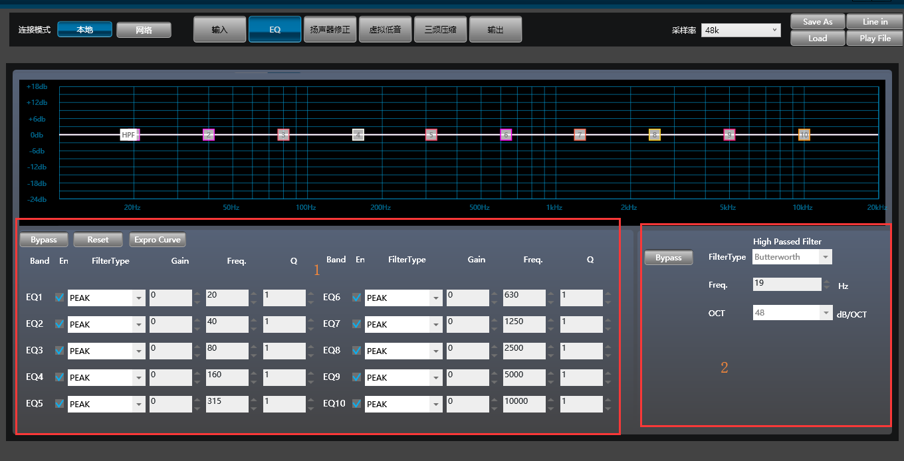
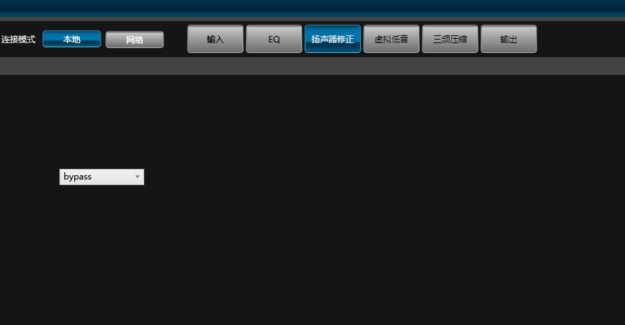
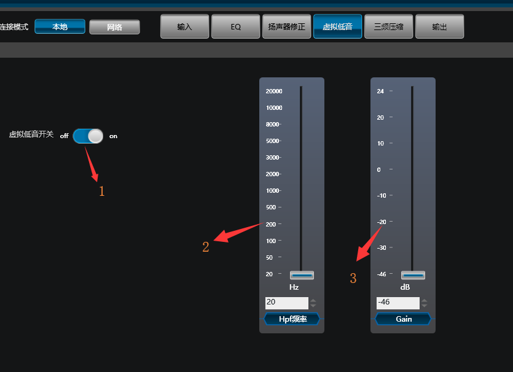
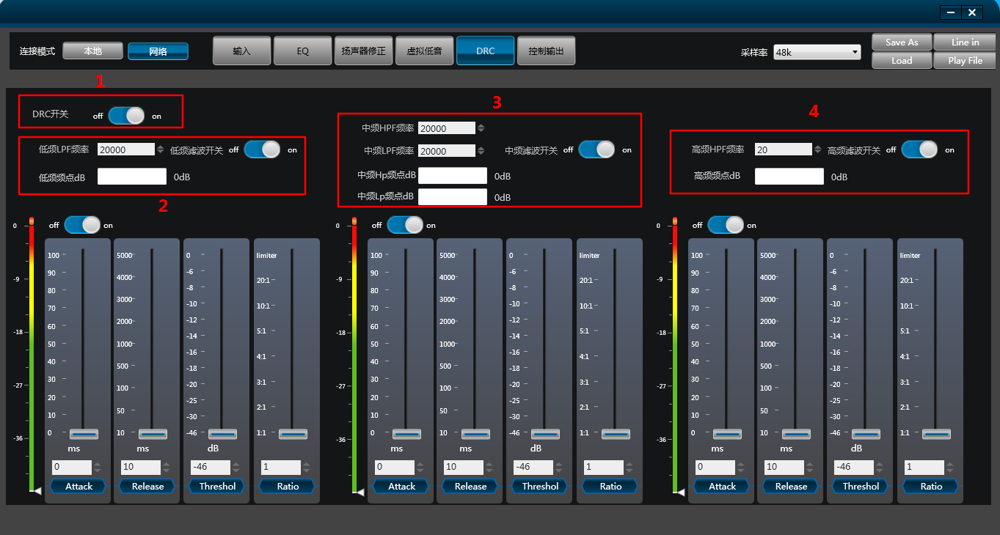
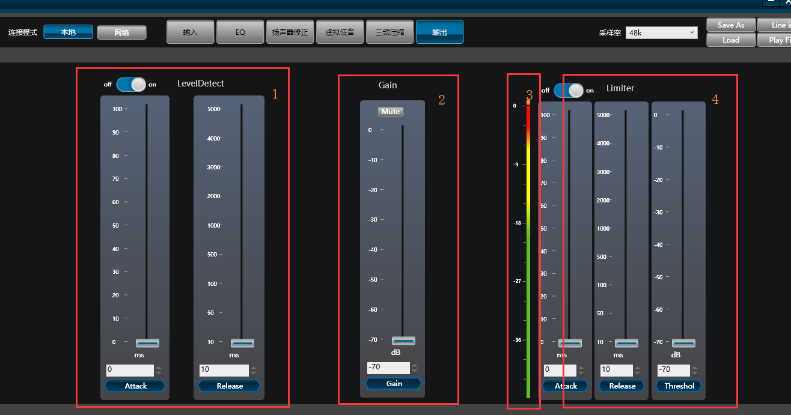

# 音效 PC 软件使用说明

## 界面

1. **主界面**：显示各种参数设置。
2. **模式选择**：
   - 本地模式：通过本地线路输入或播放文件的音频调试音效，并可保存参数设置。
   - 网络模式：通过局域网调试设备的音效参数。
3. **功能菜单**
4. **采样率选择**
5. **保存设置或读取配置**
6. **Line in / Play file**：用于本地播放音频。

## 如何调试设备的音效参数

### 连接设备

1. 确保设备与 PC 已连接到同一个局域网，并且设备与 PC 间能相互 ping 通；
2. 确保设备端的 ALSA 配置文件（asound.conf）中 `sona_audioaef` plugin 中的 `runtime_config` 为 `true`（配置项的具体含义请参考 plugin 的说明文档 [README.md](../../doc/README.md)）；
3. 操作设备端通过 `sona_audioaef` plugin 开始播放音频；
4. PC 软件按照下述步骤连接设备：
   1. 点选网络
   2. 选择本地的网卡（电脑中可能会有多张网卡）
   3. 点击 “搜索设备” 按钮
   4. 在发现设备列表中，双击选择要连接的设备 IP
   5. 连接成功后，设备端当前的参数会自动同步到 PC 软件

### 调试参数

连接设备后，在各个功能菜单中参数的改动会实时同步到设备中，设备参数的改动也会打印到标准输出（stdout）中。

### 保存配置

调试完成后，点击 “Save As” 按钮可保存当前配置到文件中（此时若设备端 `sona_audioaef` plugin 配置中的 `save_runtime_config` 为 `true`，设备端会将当前配置 **覆盖** 保存到 `config_file` 指定的文件中）。

### 读取配置

若之前已经调好了一份参数配置文件，可以在 PC 软件与设备端连接上后，点击 “Load” 按钮加载。加载成功后的参数也会同步到设备端。

### 注意事项

#### 设备端要在联网后再开始播放音乐

设备端软件注册网络服务是在播放初始化的时候，若在联网前就开始播放音乐，网络服务的注册就会失败，导致后续 PC 软件无法寻找到设备。因此需要确保 **先联网，后播放音乐**。

#### 调试过程中设备端的音乐播放不能停

设备端的 sona 音效库是以 ALSA plugin 的方式进行使用，因此每次开始播放时都会进行初始化操作（初始化算法库、读取配置文件参数等）。如果在 PC 软件调参数的过程中设备端停止后再重新播放，此时各项参数就会乱掉，实际的播放效果可能就与预期的不符。

从细节上准确来说，音效库的初始化是在设置 hw_params 的时候，因此若设备端的应用软件不释放声卡句柄 **并且** 没有重新设置 hw_params，在调试过程中暂停也是允许的。

#### 调试过程中网络不稳定有可能导致配置文件没有完全生效

若调试过程中网络不稳定，可能导致 PC 软件上调的某些参数没有成功发送到设备端，与上面类似，此时实际的播放效果会与 PC 软件设置的参数不符。

#### 不能完全依赖设备端自动保存配置文件

由上面可以看出，调试过程中的一些意外情况可能导致设备端的参数与 PC 软件的不同，因此即使设置了 `save_runtime_config`，设备端最后保存的配置文件也不一定是预期的参数。推荐调试完成后把 PC 软件保存的配置文件放置到设备端，重新验证效果是否符合预期。

### 推荐的调试步骤

1. 将默认或之前调试好的音效配置文件放置到设备端，并确保 ALSA 的配置文件无误；
2. PC 与设备连接到同一个局域网；
3. 设备端开始播放音乐；
4. PC 软件连接上设备；
5. 在调试过程中设备端的播放都不要停；
6. 调试完参数后，在 PC 软件上保存音效参数到文件中，看到 “Saved Completed” 的弹窗后才停止设备的播放；

如果在调试中途出现意外情况，如设备播放停止了、因为网络问题导致 PC 与设备断开等，请执行下述步骤：

1. 关闭 PC 软件，停止设备播放；
2. 将已经保存好的音效参数配置文件重新放置到设备端；
3. 重新开始联网、播放音乐、PC 连接设备等操作，重新开始调试。

调试完成后，将 PC 软件保存的配置文件放置到设备端，验证效果是否符合预期。

## 功能菜单说明

### 输入

1. 输入 level detect 设置
2. 输入电平显示
3. 输入 gain 设置

### EQ

1. 主通道 10 段 EQ 设置
2. 主通道高通滤波器（4 阶巴特沃斯）

### 扬声器修正（本地模式可用）

可选择以下模式：bypass、gene、hivi、idea、idea601、idea1025。

### 虚拟低音（本地模式可用）

1. 虚拟低音开关
2. 全频通道高通滤波器（4 阶）
3. 虚拟低音 gain 设置

### 三分频压缩

1. 低频低通滤波（L-R 4 阶）
2. 中频带通滤波（L-R 4 阶）
3. 高频高通滤波（L-R 4 阶）
4. 三分频 compressor 设置

### 输出

1. 输出 level detect 设置
2. 输出 gain 设置
3. 输出电平显示
4. 输出 limiter 设置
